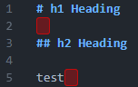

# Trailing Space Highlight

A VS Code extension that highlights trailing whitespace in red.

## Features

- Highlights trailing spaces and tabs with a red background
- Hover over the highlighted area to see the number of trailing characters
- Updates in real time when you open or edit a file

## Installation

Install it from the Visual Studio Code Marketplace.

<!-- markdownlint-disable-next-line MD013 -->

<https://marketplace.visualstudio.com/items?itemName=seiya-koji.trailing-space-highlight>

## Usage

After installation, restart VS Code. The extension activates automatically.  
No additional configuration required.
